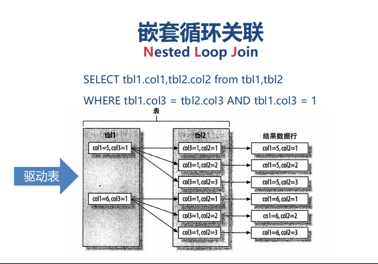
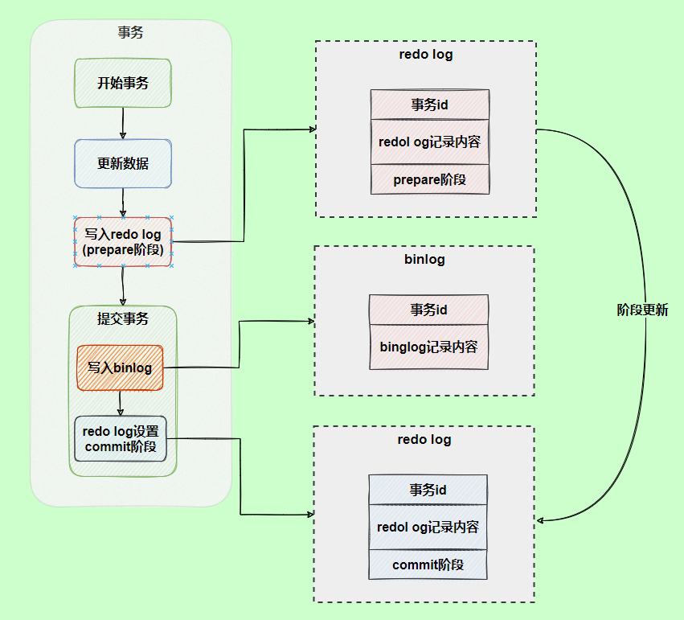

# mysql优化方案

#### 范式与反范式

范式造成的辅助表太多,反范式使用一些冗余字段来避免过多的单表,易于管理

反范式的缺点由于冗余数据的存在,所以在修改操作时,需要额外修改数据,更新从表

#### 代理主键与自然主键

自然主键(如身份证等)是指事物属性中的自然唯一标示,代理主键是指与业务无关的,无意义的数字序列值

在表设计时,优先推荐代理主键,不推荐自然主键,因为代理主键是业务无关的,可以在业务中方便迁移

#### 数据类型的选择

无符号的int替换bigint更节省空间(每一页16kb,当一页存储数据越多时io效率越高)

varchar:使用最小符合需求的长度 并且varchar(255)以下使用额外一个字节保存长度,以上则使用两个字节保存长度

varchar(5)与char(255)占用空间是一样的,但mysql为其分配的内存时不一样的,通常情况下使用varchar(20)和varchar(255)保存较短的字符串’hello world’时,占用的空间都是一样的，但使用长度较短的列却有巨大的优势。较大的列使用更多的内存，MySQL通常会分配固定大小的内存块来保存值

char:波动不大的数据,如md5后的密码,短字符串,经常更新的字符串

datetime:固定八个字节,与时区无关,保存到毫秒,ps:不使用字符串保存时间类型(无法使用内置函数进行操作,使用了多余字节)

timestamp(时间戳类型):四个字节保存数据,2038年后超出范围,精确到秒,整形存储,其实是一个特殊的整形,依赖时区,自动更新timestamp列的值

#### 使用联合索引来避免回表

什么是回表:innodb引擎下,id为PK，聚集索引，叶子节点存储行记录；
name为KEY，普通索引，叶子节点存储PK值，即id；
当使用name查询时,可以得到name,和id,此时就不需要回表,如果查询的时name,id,sex,那么sex这个字段的值是没有的,这个时候就要通过主键id再去查一次,此过程为回表

复合条件的查询必须要包括左侧列

#### 超大分页优化:

select * from table where age > 20 limit 1000000,10
改为:
select * from table where id in (select id from table where age > 20 limit 1000000,10)

### 存储引擎篇

#### 主要体系结构

连接管理器,查询缓存,查询解析器,查询优化器  -> 存储引擎

#### innodb:

innodb使用独立表空间(推荐),.frm保存字段格式,idb保存数据,设置innodb_file_per_table决定表空间模式

为什么推荐使用独立表空间而不是用系统表空间

- 系统表空间 all in one 不利于管理 

- 系统表空间会产生IO瓶颈 
- 系统表空间很难回收存储空间 
- 独立表空间使用optimize table 命令回收存储空间

innodb默认使用行级锁,但是需要记住,**利用索引的更新才会使用行级锁**,否则还是表级锁

#### MyISAM

不支持事务,但支持全文索引,支持text支持前缀索引,支持数据压缩,表级锁

应用场景:

- 非事务应用,保存应用
- 只读类应用,报表数据,字典数据(国家,邮政编码)

#### Memory

不支持事务,内存读写,临时存储,超高的读写效率,

应用场景:

读多写少的静态数据

充当缓存使用,保存高频访问静态数据

### 索引调优

#### 索引分类:

根据存储结构分类:B+,Hash索引,全文索引,R-Tree索引

根据应用层次来分类:普通索引,唯一索引,复合索引,主键索引(特殊的唯一索引)

数据的物理顺序,叶子结点是否储存全部数据,聚集索引与非聚集索引

#### 为什么推荐使用自增主键作为索引?

因为自增的肯定是最大的,对于索引数的调整变化是最小的,加入一个最大的即可,如果以其他字段,无须的,数据新增时这个树所需要的变化非常复杂

#### 聚集与非聚集索引

MyISAM是非聚集索引,叶子结点保存了物理数据的指针,需要再寻址一次找到数据

InnoDB是聚集索引，数据文件是和（主键）索引绑在一起的,主键索引结点直接保存了数据,但二者索引都是基于B+

创建索引名,idx_uid   idx_字段名

右like虽然可以使用到索引,但其效率由提供字符串的区分度决定,如果选择性很小,那么右like效率依然会很地

避免不了使用左边like的情况下应该使用Es将这部分单独出来

!= not in 都会索引失效,没有优化的可能

#### Hash索引:

目前只有memory支持hash索引

#### 索引失效的几种情况

索引选择性太差, != not in, is null可以使用索引 但is not null 不会使用索引

跳过左侧列,直接查询右侧索引字段

对索引列进行计算或者使用函数

多字段进行排序时,左侧字段必须是升序,且多字段的顺序不允许打乱来避免文件排序	

减少表与索引碎片: analyze table 表名; optimize table 表名;

#### 多表关联优化

嵌套循环关联

驱动表越小越好,这样循环次数越小 先查出驱动表符合条件的数据,再拿每一条数据去找

mysql会自动找到小的表作为驱动表

explain第一条出现的表就是驱动表



外键加索引

### 慢sql与执行计划

开启慢日志,设定执行时间与记录位置,还可以记录没有使用到索引的sql

### 分库分表

分区表:就是把大表按条件单独存储到不同的”物理 小表”中,在构建出的完整”逻辑表”,分区是将数据分段划分在多个位置存放，可以是同一块磁盘也可以在不同的机器。分区后，表面上还是一张表，但数据散列到多个位置了。app读写的时候操作的还是大表名字，db自动去组织分区的数据。

分区表的优点:

- 更少的数据检索范围 
- 拆分超级大的表,将部分数据加载至内存 
-  分区表的数据更容易维护 
-  分区表数据文件可以分布在不同的硬盘上,并发IO • 减少锁的范围,避免大表锁表 
- 可独立备份,恢复分区数据

innodb默认会将一个表的所有数据放在一个idb文件中,但是如果使用了分区,就会将数据分布在几个idb文件中

```sql
  partition by range(id)(
     partition  p0  values  less  than(10),
     partition  p1  values  less  than(20)
);
```

分区表的使用条件限制比较多

### Mvcc多版本控制

mvcc是一种多版本并发控制,主要在读已经提交和重复读两种隔离级别下工作

mvcc主要是根据每行记录的两个隐藏字段,一个事务id,一个指针,通过这个指针可以找到上一次修改前的信息

每对记录进行改动,就会记录一个undo日志,并且有一个指针指向上一次的数据,这样就会形成一个版本链

ReadView: 收集当前活跃的读写事务id,然后放在一个列表中,然后开启一个事务去访问该记录,那么访问该条记录的某个事务版本是否可见,判断如下:

如果当前id < 列表最小值,说明生成该版本的事务早已提交,所以该版本可以被当前事务访问

如果当前事务id > 列表最大值,说明生成该版本的事务还没提交  则不能访问,不能访问是需要对该记录的指针找到上一次修改的地方,进入下一次判断

如果在列表中最大的事务id和最小事务id之间,则需要判断当前id在不在列表中,如果在,说明该生成该版本的事务还是活跃的,不能访问,如果不在,则说明该事务已经提交了,可以访问

### mysql主从复制:

主要是三个线程主线程一个,主结点一个,从节点两个

当从节点连接主节点时，主节点会创建一个log dump 线程，用于发送bin-log的内容

当从节点上执行`start slave`命令之后，从节点会创建一个I/O线程用来连接主节点，请求主库中更新的bin-log

SQL线程负责读取relay log中的内容，解析成具体的操作并执行，最终保证主从数据的一致性

### mysql三大日志

- 二进制日志binlog:记录所有更改操作,属于mysql server层,是mysql的逻辑日志(

  简单来说逻辑日志记录的就是sql,物理日志就是数据页变更,mysql 数据最终存在数据页的，物理日志记录的就是数据页变更),

  刷盘时机在事务提交之后,

  应用场景: 主从复制和数据恢复

- redolog(重做日志):属于innodb引擎的日志,其他的储存引擎没有的,属于物理日志,也就是记录数据页的修改

  作用一:因为mysql每次的修改都需要写回数据页会有严重的性能问题,随机io,并且改动量很小但是要刷整个数据页,所以有了WSL技术,就是先先到redo log日志中,等到适合的时候再将日志中记录的内容写到数据盘,因为redo log是顺序写,并且内容很少,所以提交效率

  作用二:确保事务的 一致性。redo日志记录事务执行后的状态，用来恢复未写入data file的已成功事务更新的数据

  两阶段提交,保证redolog和binlog日志数据恢复一致

  

  redo log容灾恢复过程: 判断 redo log 是否完整，如果判断是完整(commit)的，直接用 Redo log恢复,

  如果 redo log 只是预提交 prepare 但不是 commit 状态，这个时候会去判断 binlog 是否完整，如果完整就提交 Redo log，用 Redo log 恢复，不完整就回滚事务，丢弃数据。

  redo log是环形写入的,所以会被覆盖,所以需要配合binlog来做到故障恢复

  

- undolog(回滚日志):针对原子性,作用:回滚数据：当数据发生异常错误时，根据执行 undo log 就可以回滚到事务之前的数据状态，保证原子性，要么全部成功，要么全部失败
  MVCC 一致性视图：通过 undo log 找到对应的数据版本号，是保证 MVCC 视图的一致性的必要条件


### 事务实现原理

原子性: 不可分割,一起回滚,一起提交  实现原理: undo log	

实现原子性的关键，是当事务回滚时能够撤销所有已经成功执行的sql语句。InnoDB实现回滚，靠的是undo log：当事务对数据库进行修改时，InnoDB会生成对应的undo log；如果事务执行失败或调用了rollback，导致事务需要回滚，便可以利用undo log中的信息将数据回滚到修改之前的样子

undo记录的是逻辑日志,对于insert,就会delete

持久性: 事务提交,对数据库的改变是永久的,其他操作或者**故障**不应该对其有任何影响 实现原理: redo log

写数据先写入日志，再更新到Buffer Pool，保证了数据不会因MySQL宕机而丢失，从而满足了持久性要求,（1）刷脏是随机IO，因为每次修改的数据位置随机，但写redo log是追加操作，属于顺序IO。

（2）刷脏是以数据页（Page）为单位的，MySQL默认页大小是16KB，一个Page上一个小修改都要整页写入；而redo log中只包含真正需要写入的部分，无效IO大大减少。

隔离性:与原子性、持久性侧重于研究事务本身不同，隔离性研究的是不同事务之间的相互影响


