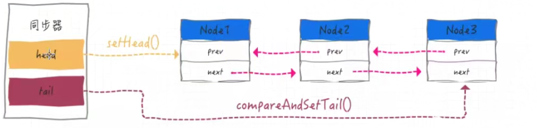

### 数据类型应用场景

string: 点赞数,阅读量,喜欢

hash: map(key,map(key,val)):  购物车

list:有序可重复,关注列表,排行榜(每次计算一次) 

set: 抽奖小程序(随机抽取set)     立即参与抽奖(加入set)   点赞(加入点赞)  关注列表(交集 并集)

zset: 排行榜

### 分布式锁:redlock -> redission

为了保证必须是加索和解锁必须是同一个线程,在加锁时可以将当前线程id+时间戳配合设置value,

解锁时进行对比必须是当前线程,如果发现相等,那么就可以进行解锁,在finally块中释放

并且解锁不具备原子性,所以需要配和lua脚本来实现(官网给出)

```lua
if redis.call("get",KEYS[1]) == ARGV[1]
then
    return redis.call("del",KEYS[1])
else
    return 0
end
```

如果不使用lua脚本,还有其他方法? 

因为取值对比和删除不是一个原子操作,所以可使用redis事务来实现

redis锁设置时间一定要大于业务执行时间? redis锁时间如何续期!!(后台需要实现一个缓存续命线程,自己实现不好解决,并且不保证完全的稳定性)

在集群环境下,redis实现的ap(分区容错性和高可用,但没有一致性):redis异步复制造成锁丢失

所以直接使用redlock之redisson的落地实现  拥有自动续期功能

```java
// 加锁以后10秒钟自动解锁
// 无需调用unlock方法手动解锁
lock.lock(10, TimeUnit.SECONDS);

// 尝试加锁，最多等待100秒，上锁以后10秒自动解锁
boolean res = lock.tryLock(100, 10, TimeUnit.SECONDS);
if (res) {
   try {
     ...
   } finally {
       lock.unlock();
   }
}
```

### redlock实现原理:

哨兵模式是主从模式的升级版，能够在故障发生时自动进行故障切换，选举出新的主节点。但由于 Redis 的复制机制是异步的，因此在哨兵模式下实现的分布式锁是不可靠的，原因如下：

- 由于主从之间的复制操作是异步的，当主节点上创建好锁后，此时从节点上的锁可能尚未创建。而如果此时主节点发生了宕机，从节点上将不会创建该分布式锁；
- 从节点晋升为主节点后，其他进程（或线程）仍然可以在该新主节点创建分布式锁，此时就存在多个进程（或线程）同时进入了临界区，分布式锁就失效了。

**因此在哨兵模式下，无法避免锁失效的问题**。因此想要实现高可用的分布式锁，可以采取 Redis 的另一个高可用方案 —— Redis 集群模式。

集群模式:

想要在集群模式下实现分布式锁，Redis 提供了一种称为 RedLock 的方案，假设我们有 N 个 Redis 实例，此时客户端的执行过程如下：

- 以毫秒为单位记录当前的时间，作为开始时间；
- 接着采用和单机版相同的方式，依次尝试在每个实例上创建锁。为了避免客户端长时间与某个故障的 Redis 节点通讯而导致阻塞，这里采用快速轮询的方式：假设创建锁时设置的超时时间为 10 秒，则访问每个 Redis 实例的超时时间可能在 5 到 50 毫秒之间，如果在这个时间内还没有建立通信，则尝试连接下一个实例；
- 如果在至少 N/2+1 个实例上都成功创建了锁。并且 `当前时间 - 开始时间 < 锁的超时时间` ，则认为已经获取了锁，锁的有效时间等于 `超时时间 - 花费时间`（如果考虑不同 Redis 实例所在服务器的时钟漂移，则还需要减去时钟漂移）；
- 如果少于 N/2+1 个实例，则认为创建分布式锁失败，此时需要删除这些实例上已创建的锁，以便其他客户端进行创建。
- 该客户端在失败后，可以等待一个随机的时间后，再次进行重试。

### 延长锁时效机制:

延长锁时效的方案如下：**假设锁超时时间是 30 秒，此时程序需要每隔一段时间去扫描一下该锁是否还存在，扫描时间需要小于超时时间，通常可以设置为超时时间的 1/3，在这里也就是 10 秒扫描一次**。如果锁还存在，则重置其超时时间恢复到 30 秒。通过这种方案，只要业务还没有处理完成，锁就会一直有效；而当业务一旦处理完成，程序也会马上删除该锁。Redis 的 Java 客户端 Redisson 提供的分布式锁就支持类似的延长锁时效的策略，称为 WatchDog，直译过来就是 “看门狗” 机制。


### 内存淘汰策略

八种淘汰策略:

1.noeviction： 返回错误，不删除任何键值(默认值.等待内存打满)

2.allkeys-lru：尝试回收最少使用的键值（LRU算法）

3.volatile-lru：尝试回收最少使用的键值，但仅限于在过期键值集合中

4.allkeys-random：回收随机的键值

5.volatile-random：回收随机的键值，但仅限于在过期键值集合中

6.volatile-ttl：回收过期集合的键值，并优先回收存活时间较短的键值

7.allkeys-lfu：回收最少使用频次的键值（LFU算法）

8.volatile-lfu：回收最少使用频次的键值（LFU算法），但仅限于在过期键值集合中

过期键的删除: 

定时删除(立即删除):立即删除能保证内存中数据的最大新鲜度，因为它保证过期键值会在过期后马上被删除，其所占用的内存也会随之释放。但是**立即删除对cpu是最不友好的**。

惰性删除:所以惰性删除可以解决一些过期了，但没被定期删除随机抽取到的key。但有些过期的key既没有被随机抽取，也没有被客户端访问，就会一直保留在数据库，占用内存，长期下去可能会导致内存耗尽。**所以Redis提供了内存淘汰机制来解决这个问题。**

定期删除:定期删除指的是Redis默认每隔100ms就**随机抽取**一些设置了过期时间的key，检测这些key是否过期，如果过期了就将其删掉。因为key太多，如果全盘扫描所有的key会非常耗性能，所以是随机抽取一些key来删除。这样就有可能删除不完，需要惰性删除配合。

lru(Least Recently Used)算法: 最近最少使用  页面置换算法

### LRU算法实现

1 投机取巧方法,使用```LinkedHashMap```,具备lru功能

```java
        Map<String, String> map = new LinkedHashMap<String, String>(1,0.75f,true);
        map.put("apple", "苹果");
        map.put("watermelon", "西瓜");
        map.put("banana", "香蕉");
        map.put("peach", "桃子");
        System.out.println(map.keySet()); //[apple, watermelon, banana, peach]
        //get之后 将watermelon提到最后
        String watermelon = map.get("watermelon");
        System.out.println(watermelon);
        System.out.println("+++++++++++++++++++++++");
        System.out.println(map.keySet()); //[apple, banana, peach, watermelon]

public class LRUCache extends LinkedHashMap
{
    public LRUCache(int maxSize)
    {
        super(maxSize, 0.75F, true);
        maxElements = maxSize;
    }

    protected boolean removeEldestEntry(java.util.Map.Entry eldest)
    {
        //逻辑很简单，当大小超出了Map的容量，就移除掉双向队列头部的元素，给其他元素腾出点地来。
        return size() > maxElements;
    }

    private static final long serialVersionUID = 1L;
    protected int maxElements;
}
```

2 手写:

结构: map + doubleList链表数实现



```java
public class LRUCacheDemo {
    //定义结点
    static class Node<K, V> {
        K key;
        V value;
        Node prev;
        Node next;

        public Node() {
            this.prev = this.next = null;
        }

        public Node(K key, V value) {
            this.key = key;
            this.value = value;
            this.prev = this.next = null;
        }
    }

    /**
     * 双向链表 里面就是我们的node
     * @param <K>
     * @param <V>
     */
    static class DoubleLinkList<K,V>{
        Node<K,V> head;
        Node<K,V> tail;

        public DoubleLinkList(){
            head = new Node<>();
            tail = new Node<>();
            head.next = tail;
            tail.prev = head;
        }

        /**
         * 双向链表添加到头
         */
        public void addHead(Node node){
            node.next = head.next;
            head.next = node;
            node.prev = head;
            head.next.prev = node;
        }

        /**
         * 删除节点
         * @param node
         */
        public void remove(Node node){
            node.next.prev = node.prev;
            node.prev.next = node.next;
            //将当前节点设置前后设置为null
            node.prev = null;
            node.next = null;
        }

        /**
         * 获取最后一个节点
         * @return
         */
        public Node getLast(){
            return tail.prev;
        }
    }

    public int cacheSize;
    /**
     * hash配合Linklist
     */
    Map<Integer, Node<Integer,Integer>> map;
    DoubleLinkList<Integer,Integer> doubleLinkList;


    public LRUCacheDemo(int cacheSize){
        this.cacheSize = cacheSize;
        map = new HashMap<>(cacheSize);
        doubleLinkList = new DoubleLinkList<>();
    }

    public int get(int key){
        if (!map.containsKey(key)) {
            return -1;
        }
        Node<Integer, Integer> node = map.get(key);
        //移除然后增加到队头
        doubleLinkList.remove(node);
        doubleLinkList.addHead(node);
        return node.value;
    }

    public void put(Node node){

    }
}
```


### 持久化

rdb 流程:

1 redis根据配置文件尝试去生成rdb快照文件

2 fork一个子进程出来

3 子进程尝试将数据dump到临时的rdb快照文件中

4 完成rdb快照文件之后,就替换掉之前的旧的快照文件

触发时机: 1 save规则会触发执行了   2 flushall命令   3 退出redis,即关闭redis服务,也会产生rdb文件   shutdown命令

另外,生成rdb文件save命令:在主线程中保存快照,阻塞当前redis服务器,直到rdb过程完成为止,不建议使用,命令也废弃  

bgsave:fork子进程进行持久化而不影响主线程工作

aof流程:

aof:append only file将所有**写命令**全部记录下来,恢复文件时把这些写命令重新执行一遍

文件位置: 配置文件dir项配置

触发时机: 

**no**: 跟随操作系统(不推荐,程序员不可控)

**always** : Redis 在每个事件循环都要将 AOF 缓冲区中的所有内容写入到 AOF 文件，并且同步 AOF 文件  (慢,安全)

**everysec：Redis** 在每个事件循环都要将 AOF 缓冲区中的所有内容写入到 AOF 文件中，并且每隔一秒就要在子线程中对 AOF 文件进行一次同步。从效率上看，该模式足够快。当发生故障停机时，只会丢失一秒钟的命令数据。 

aof重写机制:


