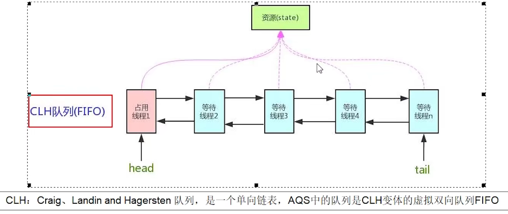

### 线程池

如果是CPU密集型任务，就需要尽量压榨CPU，参考值可以设为 NCPU+1

如果是IO密集型任务，参考值可以设置为2*NCPU


### 并发容器

#### HashMap

##### 为什么hashmap数组长度是2的幂次方

找到 KEY 的位置在哈希表的哪个槽里面时,使用了位运算,``` hash(KEY) & (length - 1)```

如果长度是类似4,8,16这种,-1后的二进制全部是1,任何数与这样的数进行与运算,并且最后得到的数在这个范围内,最重要的是奇偶性都是不确定的,保证散列的均匀性

但如果长度是一个奇数,那么化成二进制后,-1后二进制最后一位必然是0,任何数和这样的数作与运算,所得的数最后一位都是0,必然是偶数,浪费数组空间的一半

同理,若长度是一个奇数 如6,-1后二进制的第二位永远是0,导致2号,3号下标都不可能有值

扩容时,两倍,长度还是2的幂次方

之前8 扩容后16 ,扩容时,数组要迁移,不需要重新hash 

```
扩容前  length = 8  hash值 length-1
  1101
& 0111
   101  下标5的位置
扩容后  length = 16  hash值 length-1 
  1101
& 1111
  1101  下标13的位置,就是原下标位置+扩容大小
```


#### 解决hash冲突的方式

扩容与数据结构两种方式解决

扩容机制:1.7版本中,是否达到阈值(负载因子0.75),是否产生hash冲突, 扩容后,再添加元素,添加元素时重新计算桶位置,扩容过程:使用头插法

```java
 void transfer(Entry[] newTable, boolean rehash) {
        int newCapacity = newTable.length;
        for (Entry<K,V> e : table) {//遍历同桶数组中的每一个桶
            while(null != e) {//顺序遍历某个桶的外挂链表
                Entry<K,V> next = e.next;//引用next
                if (rehash) {
                    e.hash = null == e.key ? 0 : hash(e.key);
                }
                int i = indexFor(e.hash, newCapacity);//找到新表的桶位置;原桶数组中的某个桶上的同一链表中的Entry此刻可能被分散到不同的桶中去了，有效的缓解了哈希冲突。
                e.next = newTable[i];//头插法插入新表中
                newTable[i] = e;
                e = next;
            }
        }
```

10->8->6   ==>  6->8->10

多线程下扩容数据迁移死循环问题:

线程1: e=10 next = 8 切换线程

线程2:使用头插法,执行,  e=8,next=10,但线程再一次调度回到线程一继续往下执行,此时环就形成了,环状单向链表


1.8版本中,先添加元素,加完之后判断是否达到阈值扩容

使用尾插法就行插入,迁移时如果是单向链表,那么将单向链表进行迁移,如果是红黑树,将双向链表进行迁移

1.8版本中维护了两套机制 先维护一个双向链表,再将这个双向链表进行树化(元素大于8时)

```java
    final void treeifyBin(Node<K,V>[] tab, int hash) {
        int n, index; Node<K,V> e;
        if (tab == null || (n = tab.length) < MIN_TREEIFY_CAPACITY)
            resize();
        else if ((e = tab[index = (n - 1) & hash]) != null) {
            TreeNode<K,V> hd = null, tl = null;
            //维护双向链表
            do {
        
                TreeNode<K,V> p = replacementTreeNode(e, null);
                if (tl == null)
                    hd = p;
                else {
                    p.prev = tl;
                    tl.next = p;
                }
                tl = p;
            } while ((e = e.next) != null);
            if ((tab[index] = hd) != null)
                //树化
                hd.treeify(tab);
        }
    }
```

数据迁移后,如果发现链表长度小于6.那么会将这个树退化为链表

多线程环境扩容操作下会有数据丢失问题,修复了jdk7的死循环问题,通过上面的分析，不难发现循环的产生是因为新链表的顺序跟旧的链表是完全相反的，所以只要保证建新链时还是按照原来的顺序的话就不会产生循环。

```java
if ((p = tab[i = (n - 1) & hash]) == null) // 如果没有hash碰撞则直接插入元素
              tab[i] = newNode(hash, key, value, null);
```

这是jdk1.8中HashMap中put操作的主函数， 注意第6行代码，如果没有hash碰撞则会直接插入元素。如果线程A和线程B同时进行put操作，刚好这两条不同的数据hash值一样，并且该位置数据为null，所以这线程A、B都会进入第6行代码中。假设一种情况，线程A进入后还未进行数据插入时挂起，而线程B正常执行，从而正常插入数据，然后线程A获取CPU时间片，此时线程A不用再进行hash判断了，问题出现：线程A会把线程B插入的数据给**覆盖**，发生线程不安全。

**为什么发生树化的个数是8?**

概率问题,一般来说单项链表达到八个且发生碰撞的几率非常小,这也符合泊松比,因为树化的过程是非常麻烦的,这样就避免了树化

```
* 0:    0.60653066
* 1:    0.30326533
* 2:    0.07581633
* 3:    0.01263606
* 4:    0.00157952
* 5:    0.00015795
* 6:    0.00001316
* 7:    0.00000094
* 8:    0.00000006
```


#### jdk1.7 ConcurrentHashMap


#### jdk1.8 ConcurrentHashMap

主要组成结构:

```java
//*表初始化和调整控制。 当消极时，
      1 表正在初始化或调整大小：-1
      2 正在扩容时:-（1 +扩容线程的数量）。 
      3 当表为null时，保存初始表大小以使用
      4 默认为零
      5 下一次扩容的阈值大小
private transient volatile int sizeCtl;

//表示链表的一个结点
static class Node<K,V> implements Map.Entry<K,V>
//hash表    
transient volatile Node<K,V>[] table;
/**
 * The next table to use; non-null only while resizing.
 扩容时新的hash表
*/
private transient volatile Node<K,V>[] nextTable;
//在转移操作期间插入箱头的节点。
//用途1:数据迁移过程中,当hash表某个key下数据已经迁移处理完毕,那么就会插入一个ForwardingNode到头节点,从表后向表前处理,这样的话带有ForwardingNode头节点都是处理过的
//用途2:在get时,如果发现了头节点,说明应该到新的table中寻找值
static final class ForwardingNode<K,V> extends Node<K,V>
    
//作为treebin的头节点,存储root和first    
static final class TreeBin<K,V> extends Node<K,V>
//红黑树的节点结构    
static final class TreeNode<K,V> extends Node<K,V>    
```

重要方法分析:

构造方法:

```java
      //initialCapacity容量
      //loadFactor 负载因子
      //concurrencyLevel 并发级别
      public ConcurrentHashMap(int initialCapacity,
                             float loadFactor, int concurrencyLevel) {
        if (!(loadFactor > 0.0f) || initialCapacity < 0 || concurrencyLevel <= 0)
            throw new IllegalArgumentException();
        if (initialCapacity < concurrencyLevel)   // Use at least as many bins
            initialCapacity = concurrencyLevel;   // as estimated threads
          
        //8的table数组是懒加载的,这里只是计算了table数组的大小,但是table数组的创建是在使用时才会创建
        long size = (long)(1.0 + (long)initialCapacity / loadFactor);
        //不管传进来的大小,通过tableSizeFor方法最终转化为16 32,64等这样的大小
        int cap = (size >= (long)MAXIMUM_CAPACITY) ?
            MAXIMUM_CAPACITY : tableSizeFor((int)size);
        //赋值给sizeCtl
        this.sizeCtl = cap;
    }
```

get方法,全程无锁

```java
    public V get(Object key) {
        Node<K,V>[] tab; Node<K,V> e, p; int n, eh; K ek;
        //为了保证key的hashcode是一个正数,因为负数会有其他作用
        int h = spread(key.hashCode());
        //找到头节点
        if ((tab = table) != null && (n = tab.length) > 0 &&
            (e = tabAt(tab, (n - 1) & h)) != null) {
            //如果头节点的hash正好等于要查找的key的hashcode
            if ((eh = e.hash) == h) {
                if ((ek = e.key) == key || (ek != null && key.equals(ek)))
                    return e.val;
            }
            //发现头节点的hash是负数,表示正在扩容中或者是treebin,此时调用find查找
            //-1表示需要到新的table数组里面去找
            //-2表示去treebin里面查找
            else if (eh < 0)
                return (p = e.find(h, key)) != null ? p.val : null;
            //既不是负数 也不是头节点 那么就遍历这个表
            while ((e = e.next) != null) {
                if (e.hash == h &&
                    ((ek = e.key) == key || (ek != null && key.equals(ek))))
                    return e.val;
            }
        }
        return null;
    }
```

put方法:

```java
    public V put(K key, V value) {
        return putVal(key, value, false);
    }

    /** Implementation for put and putIfAbsent */
    final V putVal(K key, V value, boolean onlyIfAbsent) {
        //与普通的hashmap不同的是,这里不允许有空的key或者空的值
        if (key == null || value == null) throw new NullPointerException();
        //保证key是正整数
        int hash = spread(key.hashCode());
        int binCount = 0;
        for (Node<K,V>[] tab = table;;) {
            Node<K,V> f; int n, i, fh;
            //该判断是为了验证hash表是否创建,因为是懒加载的,所以在put时创建table数组
            if (tab == null || (n = tab.length) == 0)
                //底层使用cas创建hash表,只有一个线程会成功
                tab = initTable();
            //判断链表头节点是否位空,如果为空,那么将k-v包装为node存入hash表
            else if ((f = tabAt(tab, i = (n - 1) & hash)) == null) {
                if (casTabAt(tab, i, null,
                             new Node<K,V>(hash, key, value, null)))
                    break;                   // no lock when adding to empty bin
            }
            //帮忙扩容 发现当前的头节点的hash时-1时,说明正在扩容,那么当前线程就会帮忙去迁移数据
            else if ((fh = f.hash) == MOVED)
                tab = helpTransfer(tab, f);
            else {
               //发生了hash冲突, 这时候才需要加锁,并且锁住的紧紧是该链表的的头节点
                V oldVal = null;
                synchronized (f) {
                    if (tabAt(tab, i) == f) {
                        
                        //头节点的hashcode是否>0  如果>0,说明是普通节点,则进行链表操作
                        if (fh >= 0) {
                            //链表长度
                            binCount = 1;
                            //遍历链表
                            for (Node<K,V> e = f;; ++binCount) {
                                K ek;
                                //key存在则更新操作
                                if (e.hash == hash &&
                                    ((ek = e.key) == key ||
                                     (ek != null && key.equals(ek)))) {
                                    oldVal = e.val;
                                    if (!onlyIfAbsent)
                                        e.val = value;
                                    break;
                                }
                                Node<K,V> pred = e;
                                //不存在则追加操作
                                if ((e = e.next) == null) {
                                    pred.next = new Node<K,V>(hash, key,
                                                              value, null);
                                    break;
                                }
                            }
                        }
                        //红黑树操作
                        else if (f instanceof TreeBin) {
                            Node<K,V> p;
                            binCount = 2;
                            //红黑树的添加
                            if ((p = ((TreeBin<K,V>)f).putTreeVal(hash, key,
                                                           value)) != null) {
                                oldVal = p.val;
                                if (!onlyIfAbsent)
                                    p.val = value;
                            }
                        }
                    }
                }
                
               
                //binCount != 0说明链表是否冲突的,
                if (binCount != 0) {
                    //是否超过阈值
                    if (binCount >= TREEIFY_THRESHOLD)
                        //树化 但不会立刻树化 先使用扩容扩容的方式  当整个hash表的长度超过64后,链表还是冲突>8的,此时树化
                        //
                        treeifyBin(tab, i);
                    if (oldVal != null)
                        return oldVal;
                    break;
                }
            }
        }
        //put成功 计数+1  计数后会判断是否需要扩容操作,因为新加的元素可能会达到扩容阈值
        //计算和维护集合长度
        addCount(1L, binCount);
        return null;
    }
```


细化方法:

initTable:初始化 hash表

```java
private final Node<K,V>[] initTable() {
    Node<K,V>[] tab; int sc;
    while ((tab = table) == null || tab.length == 0) {
        if ((sc = sizeCtl) < 0)
            Thread.yield(); // lost initialization race; just spin
        
        //使用cas方式将sizectl的值修改为-1 表示正在创建hash表 若该线程cas成功,则会进入if快 若失败 则会进入下一层循环
        else if (U.compareAndSwapInt(this, SIZECTL, sc, -1)) {
            //获得锁的线程创建table,其他线程则一直在循环中放弃yield,等到table创建进而退出循环
            try {
                //sc: 初始容量
                if ((tab = table) == null || tab.length == 0) {
                    //是否有传进来的容量 否则使用默认值16  注意,这个sc已经在构造器中处理过,这里必然是2的幂次方
                    int n = (sc > 0) ? sc : DEFAULT_CAPACITY;
                    @SuppressWarnings("unchecked")
                    Node<K,V>[] nt = (Node<K,V>[])new Node<?,?>[n];
                    table = tab = nt;
                    //此时代表下次扩容时的阈值
                    sc = n - (n >>> 2);
                }
            } finally {
                sizeCtl = sc;
            }
            break;
        }
    }
    return tab;
}
```

扩容过程讲解: 涉及到多个线程的共同扩容

什么时候会协助扩容,当添加元素时,发现头节点的hash时-1,说经此时正在迁移,帮助扩容

```java
private final void transfer(Node<K,V>[] tab, Node<K,V>[] nextTab) {
    int n = tab.length, stride;
    //计算每个线程的任务量 将table分割,一个线程最少会负责16个元素
    if ((stride = (NCPU > 1) ? (n >>> 3) / NCPU : n) < MIN_TRANSFER_STRIDE)
        stride = MIN_TRANSFER_STRIDE; // subdivide range
    
    //新tab也是懒加载的
    if (nextTab == null) {            // initiating
        try {
            @SuppressWarnings("unchecked")
            Node<K,V>[] nt = (Node<K,V>[])new Node<?,?>[n << 1];
            nextTab = nt;
        } catch (Throwable ex) {      // try to cope with OOME
            sizeCtl = Integer.MAX_VALUE;
            return;
        }
        nextTable = nextTab;
        transferIndex = n;
    }
    int nextn = nextTab.length;
    ForwardingNode<K,V> fwd = new ForwardingNode<K,V>(nextTab);
    boolean advance = true;
    boolean finishing = false; // to ensure sweep before committing nextTab
    for (int i = 0, bound = 0;;) {
        Node<K,V> f; int fh;
        while (advance) {
            int nextIndex, nextBound;
            if (--i >= bound || finishing)
                advance = false;
            else if ((nextIndex = transferIndex) <= 0) {
                i = -1;
                advance = false;
            }
            else if (U.compareAndSwapInt
                     (this, TRANSFERINDEX, nextIndex,
                      nextBound = (nextIndex > stride ?
                                   nextIndex - stride : 0))) {
                bound = nextBound;
                i = nextIndex - 1;
                advance = false;
            }
        }
        if (i < 0 || i >= n || i + n >= nextn) {
            int sc;
            if (finishing) {
                nextTable = null;
                table = nextTab;
                sizeCtl = (n << 1) - (n >>> 1);
                return;
            }
            if (U.compareAndSwapInt(this, SIZECTL, sc = sizeCtl, sc - 1)) {
                if ((sc - 2) != resizeStamp(n) << RESIZE_STAMP_SHIFT)
                    return;
                finishing = advance = true;
                i = n; // recheck before commit
            }
        }
        //链表头如果是null,说明这个链表已经处理完了,所以将链表头替换为fwd节点ForwardingNode
        else if ((f = tabAt(tab, i)) == null)
            advance = casTabAt(tab, i, null, fwd);
        //如果发现这个头节点的hash是-1.说明已经处理完了
        else if ((fh = f.hash) == MOVED)
            advance = true; // already processed
        else {
            //锁住头节点 处理该链表
            synchronized (f) {
                if (tabAt(tab, i) == f) {
                    Node<K,V> ln, hn;
                    //普通节点
                    if (fh >= 0) {
                        int runBit = fh & n;
                        Node<K,V> lastRun = f;
                        for (Node<K,V> p = f.next; p != null; p = p.next) {
                            int b = p.hash & n;
                            if (b != runBit) {
                                runBit = b;
                                lastRun = p;
                            }
                        }
                        if (runBit == 0) {
                            ln = lastRun;
                            hn = null;
                        }
                        else {
                            hn = lastRun;
                            ln = null;
                        }
                        for (Node<K,V> p = f; p != lastRun; p = p.next) {
                            int ph = p.hash; K pk = p.key; V pv = p.val;
                            if ((ph & n) == 0)
                                ln = new Node<K,V>(ph, pk, pv, ln);
                            else
                                hn = new Node<K,V>(ph, pk, pv, hn);
                        }
                        setTabAt(nextTab, i, ln);
                        setTabAt(nextTab, i + n, hn);
                        setTabAt(tab, i, fwd);
                        advance = true;
                    }
                    //二叉树结点
                    else if (f instanceof TreeBin) {
                        TreeBin<K,V> t = (TreeBin<K,V>)f;
                        TreeNode<K,V> lo = null, loTail = null;
                        TreeNode<K,V> hi = null, hiTail = null;
                        int lc = 0, hc = 0;
                        for (Node<K,V> e = t.first; e != null; e = e.next) {
                            int h = e.hash;
                            TreeNode<K,V> p = new TreeNode<K,V>
                                (h, e.key, e.val, null, null);
                            if ((h & n) == 0) {
                                if ((p.prev = loTail) == null)
                                    lo = p;
                                else
                                    loTail.next = p;
                                loTail = p;
                                ++lc;
                            }
                            else {
                                if ((p.prev = hiTail) == null)
                                    hi = p;
                                else
                                    hiTail.next = p;
                                hiTail = p;
                                ++hc;
                            }
                        }
                        ln = (lc <= UNTREEIFY_THRESHOLD) ? untreeify(lo) :
                            (hc != 0) ? new TreeBin<K,V>(lo) : t;
                        hn = (hc <= UNTREEIFY_THRESHOLD) ? untreeify(hi) :
                            (lc != 0) ? new TreeBin<K,V>(hi) : t;
                        setTabAt(nextTab, i, ln);
                        setTabAt(nextTab, i + n, hn);
                        setTabAt(tab, i, fwd);
                        advance = true;
                    }
                }
            }
        }
    }
}
```


计数方法:

长度维护原理:含有一个基础变量baseCount(基本计数器值，主要在没有争用时使用),线程在元素添加之后,首先对baseCount进行++,如果有两个线程进行++操作,此时就会有安全问题,这个时候就会用到一个数组CounterCell,这里面有一个value属性,对这个数组的某个元素的value进行++,最后集合长度=baseCount+CounterCell中value组合

```java
private final void addCount(long x, int check) {
    //维护集合长度
    CounterCell[] as; long b, s;
    //检查counterCells是否为null
    if ((as = counterCells) != null ||
        //对baseCount进行加法操作,如果加成功了返回true则这个if进不来,所以这个计数就加到baseCount上面去了
        !U.compareAndSwapLong(this, BASECOUNT, b = baseCount, s = b + x)) {
        
        //对baseCount加失败了进入此段 说明存在竞争
        CounterCell a; long v; int m;
        boolean uncontended = true;
        if (as == null || (m = as.length - 1) < 0 ||
            (a = as[ThreadLocalRandom.getProbe() & m]) == null ||
            !(uncontended =
              U.compareAndSwapLong(a, CELLVALUE, v = a.value, v + x))) {
            //这个方法很复杂,就是对CounterCell单元的操作
            fullAddCount(x, uncontended);
            return;
        }
        if (check <= 1)
            return;
        
        //计算所有CounterCell数组的值,累加得到集合长度
        s = sumCount();
    }
    
    //判断是否需要扩容
    if (check >= 0) {
        Node<K,V>[] tab, nt; int n, sc;
        //集合长度是否大于阈值
        while (s >= (long)(sc = sizeCtl) && (tab = table) != null &&
               (n = tab.length) < MAXIMUM_CAPACITY) {
            int rs = resizeStamp(n);
            if (sc < 0) {
                //第二个线程进来扩容 发现sc<0 说明有线程正在扩容 此时协助扩容
                if ((sc >>> RESIZE_STAMP_SHIFT) != rs || sc == rs + 1 ||
                    sc == rs + MAX_RESIZERS || (nt = nextTable) == null ||
                    transferIndex <= 0)
                    break;
                //协助扩容 
                if (U.compareAndSwapInt(this, SIZECTL, sc, sc + 1))
                    transfer(tab, nt);
            }
            else if (U.compareAndSwapInt(this, SIZECTL, sc,
                                         (rs << RESIZE_STAMP_SHIFT) + 2))
                //线程第一次进来 进行扩容 在if判断中将sc变成负数
                transfer(tab, null);
            s = sumCount();
        }
    }
}
```


#### 面试题:

```java
Map map = new ConcurrentHashMap<>(32);
//这种情况下map的容量是32吗
//答:在jdk8环境下,最终的容量是64 sizectl,也就是说经过计算会得到一个大于传进入的数最近的一个2的幂次方
//计算方式: initialCapacity + (initialCapacity >>> 1) + 1   1.5个单位再加1
```

sizectl的意义:

>  `sizeCtl`为0，代表数组未初始化， 且数组的初始容量为16
>
> `sizeCtl`为正数，如果数组未初始化，那么其记录的是数组的初始容量，如果数组已经初始化，那么其记录的是数组的扩容阈值
>
> `sizeCtl`为-1，表示数组正在进行初始化
>
> `sizeCtl`小于0，并且不是-1，表示数组正在扩容， -(1+n)，表示此时有n个线程正在共同完成数组的扩容操作

如何保证hashcode一个正数:  因为被与的这个最高位是0,任何数与之作与运算都会是正数

```java
    static final int spread(int h) {
        return (h ^ (h >>> 16)) & HASH_BITS;
    }
```


### AQS源码解析:



aqs是并发包的基石,加锁会导致阻塞、有阻塞就需要排队,实现排队必然需要队列,如果共享资源被占用,就需要一定的阻塞等待唤醒机制来保证锁分配。这个机制主要用的是CLH队列的变体实现的,将暂时获取不到锁的线程加入到队列中,这个队列就是AQS的抽象表现。它将请求共享资源的线程封装成队列的结点(Node) ,通过CAS、自旋以及LockSuport.park()的方式,维护state变量的状态,使并发达到同步的效果

变量+等待队列

源码解析:

```AbstractQueuedSynchronizer```类: 

```java

    /**
     * The synchronization state.
     */
    private volatile int state;
```

Node结点: 队列中每一个排队的个体,就说一个Node

node说明:

```java
volatile int waitStatus;  //当前结点等待线程的在队列中的等待状态
//前后 头 尾指针
volatile Node prev;
volatile Node next;
private transient volatile Node head;
private transient volatile Node tail;
//waitStatus几个状态
/** waitStatus value to indicate thread has cancelled */
static final int CANCELLED =  1;  //表示该结点获取锁的请求已经取消了
/** waitStatus value to indicate successor's thread needs unparking */
static final int SIGNAL    = -1;  //已经准备好了 等待资源始放
/** waitStatus value to indicate thread is waiting on condition */
static final int CONDITION = -2;  //等待中,等待被唤醒
/**
         * waitStatus value to indicate the next acquireShared should
         * unconditionally propagate
         */
static final int PROPAGATE = -3;
```

通过ReentrantLock解读aqs:

```java
//非公平锁
NonfairSync 
//公平锁
FairSync    
```

**从lock方法开始**:  lock加锁方法在非公平与公平锁的区别就说判断该结点是不是第一个等待的结点,如果是,则获取,因为是公平锁,所以先入先得```hasQueuedPredecessors()```判断

```java
//公平锁:
final void lock() {
    acquire(1);
}

//非公平锁
final void lock() {
    if (compareAndSetState(0, 1))  //通过cas方法将aqs类中的State变量设置为1,表示锁占用情况
        setExclusiveOwnerThread(Thread.currentThread());  //如果抢占锁成功 将当前线程设置
    else
        acquire(1);   //通过cas失败 发现有人占了这个锁
}
```

```acquire(1)```方法:

```java
public final void acquire(int arg) {
    //此处有三个方法 tryAcquire  acquireQueued  addWaiter
    if (!tryAcquire(arg) &&
        acquireQueued(addWaiter(Node.EXCLUSIVE), arg))
        selfInterrupt();
}
```

tryAcquire: 最终由该方法实现:

```java
final boolean nonfairTryAcquire(int acquires) {
    final Thread current = Thread.currentThread();
    int c = getState();
    //判断锁是否被抢占 线程b进来后 c 已经 =1 
    if (c == 0) {
        //正好a线程使用完毕 c==0,直接获取锁
        if (compareAndSetState(0, acquires)) {
            setExclusiveOwnerThread(current);
            return true;
        }
    }
    //当前获得锁的线程是a,也不是当前线程b 
    else if (current == getExclusiveOwnerThread()) {
        //正好a使用完毕后再一次得到执行  可重入锁
        int nextc = c + acquires;
        if (nextc < 0) // overflow
            throw new Error("Maximum lock count exceeded");
        setState(nextc);
        return true;
    }
    //所以最后返回false
    return false;
}
```

addWaiter方法: 此时b线程没有获取到锁,那么就要入队开始等待

```java
private Node addWaiter(Node mode) {
    Node node = new Node(Thread.currentThread(), mode);
    // Try the fast path of enq; backup to full enq on failure
    Node pred = tail;
    //b线程进来时 尾结点为空 不进入  
    //c线程进来时 尾结点部不为空 进入
    if (pred != null) {
        node.prev = pred;
        if (compareAndSetTail(pred, node)) {
            pred.next = node;
            return node;
        }
    }
    //入队
    enq(node);
    return node;
}

    private Node enq(final Node node) {
        //死循环
        for (;;) {
            Node t = tail;
            //线程b进来时 尾结点必然是null
            if (t == null) { // Must initialize
                //通过cas的方式,给头节点设置一个空node
                if (compareAndSetHead(new Node()))
                  	//同时尾指针也指向这个空结点(哨兵结点)  第一次循环结束 见图 第一次循环
                    tail = head;
            } else {
                //第二次循环  将b线程这个结点设置为为结点,并与烧饼结点互相指向,图 第二次循环
                node.prev = t;
                if (compareAndSetTail(t, node)) {
                    t.next = node;
                    return t;
                }
            }
        }
    }
	

    final boolean acquireQueued(final Node node, int arg) {
        boolean failed = true;
        try {
            //被打算
            boolean interrupted = false;
            //自旋
            for (;;) {
                //该结点的前一个结点 b线程时刻, p为哨兵结点 也是头结点
                final Node p = node.predecessor();
                //再次尝试枪锁
                if (p == head && tryAcquire(arg)) {
                    //抢锁成功
                    setHead(node);
                    p.next = null; // help GC
                    failed = false;
                    return interrupted;
                }
                //再次枪锁失败 此时应该park该线程  p: 哨兵结点 node :b结点  shouldParkAfterFailedAcquire:
                if (shouldParkAfterFailedAcquire(p, node) && 
                    //自旋第二次时 进入parkAndCheckInterrupt,该方法会调用 LockSupport.park(this)阻塞当前线程 等待许可
                    parkAndCheckInterrupt())
                    interrupted = true;
            }
        } finally {
            if (failed)
                cancelAcquire(node);
        }
    }


    private static boolean shouldParkAfterFailedAcquire(Node pred, Node node) {
        //哨兵结点刚刚创建时 waitStatus默认值为 -1   所以自旋第一次进来时所以走最后一个else
        int ws = pred.waitStatus;
        //自旋第二次进来时 该if成立
        if (ws == Node.SIGNAL)
            /*
             * This node has already set status asking a release
             * to signal it, so it can safely park.
             */
            return true;
        if (ws > 0) {
            /*
             * Predecessor was cancelled. Skip over predecessors and
             * indicate retry.
             */
            do {
                node.prev = pred = pred.prev;
            } while (pred.waitStatus > 0);
            pred.next = node;
        } else {
            /*
             * waitStatus must be 0 or PROPAGATE.  Indicate that we
             * need a signal, but don't park yet.  Caller will need to
             * retry to make sure it cannot acquire before parking.
             */
            //将哨兵结点的waitStatus设为Node.SIGNAL
            compareAndSetWaitStatus(pred, ws, Node.SIGNAL);
        }
        return false;
    }

```


当c线程到来时,发现锁继续被占有,此时尾结点不为空

```java
//c线程进来时 尾结点部不为空
if (pred != null) {
    node.prev = pred;
    if (compareAndSetTail(pred, node)) {
        pred.next = node;
        return node;
    }
}此时情况如下:
```


经过上面的分析,B,C节点都已经进入等待队列并且阻塞中,等待a节点线程unlock

开始unlock方法:

```java
public void unlock() {
    sync.release(1);
}
//release
public final boolean release(int arg) {
    //tryRelease
    if (tryRelease(arg)) {
        //头指针
        Node h = head;
        if (h != null && h.waitStatus != 0)
            //唤醒h节点(h是哨兵节点)
            unparkSuccessor(h);
        return true;
    }
    return false;
}

//unparkSuccessor
    private void unparkSuccessor(Node node) {
        /*
         * If status is negative (i.e., possibly needing signal) try
         * to clear in anticipation of signalling.  It is OK if this
         * fails or if status is changed by waiting thread.
         */
        int ws = node.waitStatus;
        if (ws < 0)
            compareAndSetWaitStatus(node, ws, 0);

        /*
         * Thread to unpark is held in successor, which is normally
         * just the next node.  But if cancelled or apparently null,
         * traverse backwards from tail to find the actual
         * non-cancelled successor.
         */
        //哨兵节点的下一个节点
        Node s = node.next;
        if (s == null || s.waitStatus > 0) {
            s = null;
            for (Node t = tail; t != null && t != node; t = t.prev)
                if (t.waitStatus <= 0)
                    s = t;
        }
        // //哨兵节点的下一个节点不为null 直接唤醒
        if (s != null)
            LockSupport.unpark(s.thread);
    }
//此时再次回到自旋锁,
//自旋
for (;;) {
    final Node p = node.predecessor();
	//此时会枪锁成功 上位tryAcquire成功
    if (p == head && tryAcquire(arg)) {
        //b结点上位成功, 将原来的哨兵结点引用取消,将b结点设置为新的哨兵结点继续工作,b线程在工作窗口工作 如图
        setHead(node);
        p.next = null; // help GC
        failed = false;
        return interrupted;
    }
    //再次枪锁失败 此时应该park该线程  p: 哨兵结点 node :b结点  shouldParkAfterFailedAcquire:
    if (shouldParkAfterFailedAcquire(p, node) && 
        //自旋第二次时 进入parkAndCheckInterrupt,该方法会调用 LockSupport.park(this)阻塞当前线程 等待许可
        parkAndCheckInterrupt())
        interrupted = true;
}


protected final boolean tryRelease(int releases) {
    // 1-1 = 0
    int c = getState() - releases;
    if (Thread.currentThread() != getExclusiveOwnerThread())
        throw new IllegalMonitorStateException();
    boolean free = false;
    //解锁成功
    if (c == 0) {
        free = true;
        //将当前窗口占用线程设置为null
        setExclusiveOwnerThread(null);
    }
    //重新设置0  表示无人占用
    setState(c);
    return free;
}
```


这么看好像是公平锁,其实不是公平，在A将status置为0，到B被唤醒并且自旋到acquire方法中间如果有新的线程加塞进来，新线程在入队前会有两次直接acquire的机会，这就是不公平的地方,也就是说,唤醒按顺序，但是入队是随机的